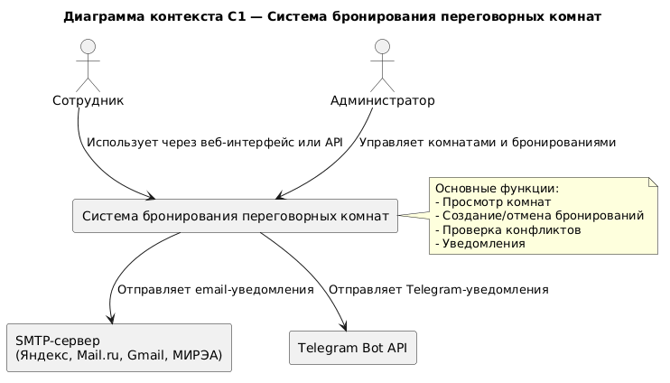
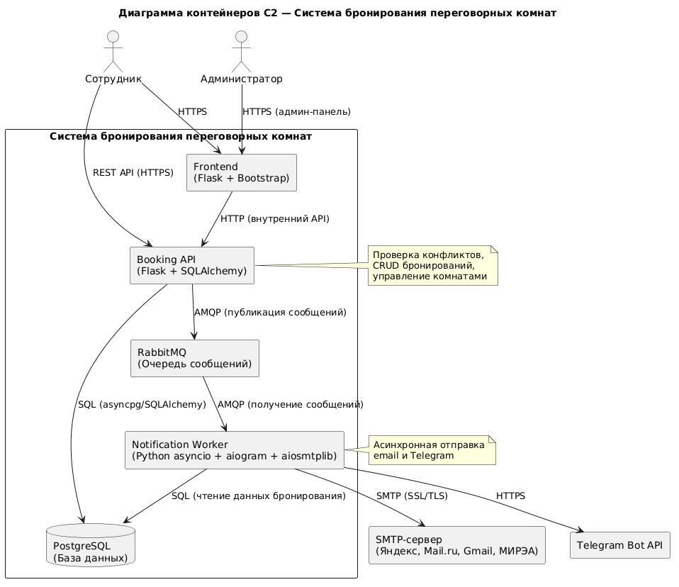
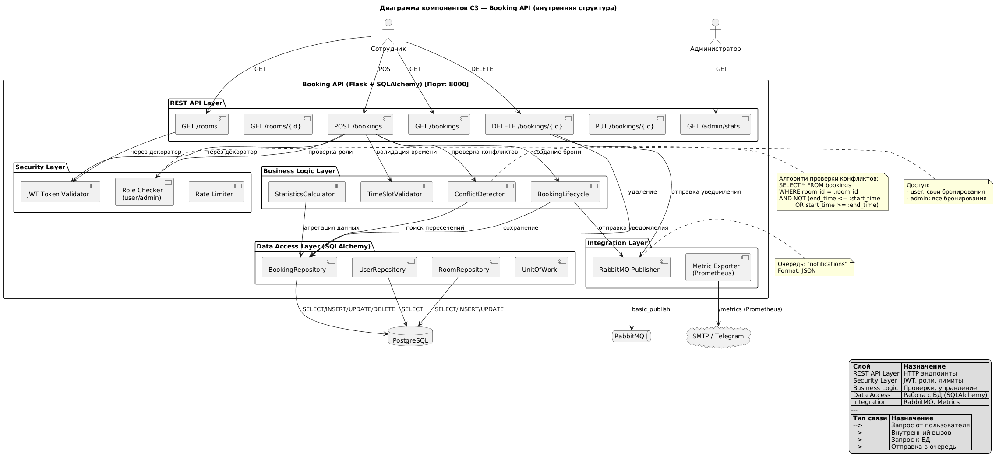

## README.md — Практика №1. Архитектурное проектирование с ИИ в нотации C4

---

### 1. Problem Statement

**Система бронирования переговорных комнат (повышенный балл)**

Сотрудники компании нуждаются в удобном инструменте для бронирования переговорных комнат с автоматическими уведомлениями о статусе бронирования и напоминаниями. Система предоставляет веб-интерфейс (Flask + Bootstrap) и REST API для просмотра доступных комнат, создания, изменения и отмены бронирований с автоматической проверкой конфликтов по времени.

**Пользователи:** сотрудники и администраторы.

**Внешние системы:** SMTP-сервер для email-уведомлений, Telegram Bot API для уведомлений через мессенджер.

**Архитектура (микросервисы, повышенный балл):**

- **booking-api** (Flask + SQLAlchemy) — API Gateway, бизнес-логика бронирования, проверка конфликтов
- **notification-worker** (asyncio + aiosmtplib + aiogram + pika) — асинхронная отправка email и Telegram-уведомлений
- **frontend** (Flask + Bootstrap) — веб-интерфейс для пользователей и администраторов
- **PostgreSQL** (StatefulSet + PVC) — основное хранилище данных
- **RabbitMQ** — очередь сообщений для асинхронного взаимодействия между сервисами

**Взаимодействие между сервисами:** пользователь создаёт бронирование → booking-api проверяет конфликты → публикует сообщение в RabbitMQ → notification-worker получает и отправляет уведомления.

**Технические требования:** Docker, Minikube, Linkerd, Jaeger, Loki, Prometheus + Grafana.

---

### 2. Диаграмма C1 — Контекст

#### Изображение



#### Ссылка на файл

[context.puml](./diagrams/context.puml)

#### Таблица анализа

| Аспект | Что сгенерировал ИИ | Что исправлено вручную | Обоснование исправления |
|--------|---------------------|------------------------|------------------------|
| Персонажи | Сотрудник и Администратор | Без изменений | Соответствует требованиям |
| Внешние системы | SMTP-сервер, Telegram Bot API | Без изменений | Два внешних сервиса для уведомлений |
| Связи | HTTPS, SMTP, Telegram API | Добавлены протоколы на стрелки | Для понимания технологий взаимодействия |
| Легенда | Отсутствовала | Добавлена текстовая легенда | Соответствие нотации C4 |
| Цветовые теги | `#Technology`, `#System`, `#External` | Удалены | Не поддерживаются онлайн-рендерером PlantUML |
| Граница системы | Не была выделена | Добавлена граница `rectangle` | Для визуального выделения нашей системы |

---

### 3. Диаграмма C2 — Контейнеры

#### Изображение



#### Ссылка на файл

[container.puml](./diagrams/container.puml)

#### Таблица анализа

| Аспект | Что сгенерировал ИИ | Что исправлено вручную | Обоснование исправления |
|--------|---------------------|------------------------|------------------------|
| Количество контейнеров | 5 (Frontend, Booking API, Worker, RabbitMQ, PostgreSQL) | Без изменений | Соответствует микросервисной архитектуре (3+ сервиса) |
| Технологии | Flask, SQLAlchemy, asyncio, pika, aiogram | Уточнены порты (5000, 8000, 5672, 5432, 8001) | Для дальнейшего деплоя в K8s |
| Связи | HTTP, SQL, AMQP, SMTP, HTTPS | Добавлены пометки `[publish]` и `[consume]` | Различие между публикацией и получением сообщений |
| Типы связей | Не указаны | Добавлены метки синхронности | Понимание асинхронной архитектуры |
| Легенда | Отсутствовала | Добавлена с описанием типов контейнеров и протоколов | Соответствие нотации C4 |
| Цветовые теги | `#WebBrowser`, `#API`, `#Worker`, `#Queue`, `#Database` | Удалены | Не поддерживаются онлайн-рендерером |
| Примечания | Отсутствовали | Добавлены `note` для Booking API и Worker | Пояснение ключевых функций |

---

### 4. Диаграмма C3 — Компоненты (Booking API)

#### Изображение



#### Ссылка на файл

[component.puml](./diagrams/component.puml)

#### Таблица анализа

| Аспект | Что сгенерировал ИИ | Что исправлено вручную | Обоснование исправления |
|--------|---------------------|------------------------|------------------------|
| Количество компонентов | 20+ компонентов | Ужато до 12 ключевых компонентов (компактная версия) | Диаграмма вылезала за границы страницы |
| Слой валидации | Отсутствовал | Добавлен `Validation Layer (Pydantic)` | Необходим для защиты от некорректных данных |
| Redis кэш | Был указан как опциональный | Удалён | Не используется в архитектуре (галлюцинация ИИ) |
| Методы API | Общие названия (`CreateBooking`) | Уточнены (`POST /bookings`) | Соответствие REST стандартам |
| Metrics экспортёр | Отсутствовал | Добавлен `Metric Exporter (Prometheus)` | Для практики №4 (мониторинг) |
| HealthCheck | Отсутствовал | Добавлен в компактной версии | Для K8s readiness/liveness пробы |
| Алгоритм в note | Общее описание | Конкретный SQL запрос в `ConflictDetector` | Демонстрация понимания бизнес-логики |
| Формат сообщения | Не указан | JSON пример в `RabbitMQ Publisher` | Для реализации интеграции |
| Легенда | Отсутствовала | Добавлена с описанием слоёв и типов связей | Соответствие нотации C4 |

---

### 5. Вывод о пригодности ИИ для проектирования архитектуры

**ИИ пригоден для проектирования архитектуры на уровне C4**, но требует ручной доработки.

#### Сильные стороны ИИ

| Аспект | Оценка | Комментарий |
|--------|--------|-------------|
| Скорость генерации | ★★★★★ | Диаграммы генерируются за секунды |
| Понимание нотации C4 | ★★★★☆ | Правильно определяет уровни C1-C3 |
| Определение микросервисов | ★★★★☆ | Выделил 5 контейнеров, включая очередь |
| Формирование связей | ★★★★☆ | Корректно указал протоколы (HTTP, AMQP, SMTP) |

#### Слабые стороны ИИ (галлюцинации)

| Аспект | Описание проблемы | Частота |
|--------|-------------------|---------|
| Цветовые теги | Генерирует `#WebBrowser`, `#API` и т.д., которые не работают в онлайн-рендерере | Высокая |
| Лишние компоненты | Добавляет Redis там, где он не нужен | Средняя |
| Отсутствие легенд | Не добавляет легенду автоматически | Высокая |
| Размер диаграмм | Генерирует слишком большие диаграммы (выходят за границы) | Средняя |
| Детализация | Иногда избыточная или недостаточная | Средняя |

#### Процентное соотношение

```
ИИ сгенерировал: ████████████████░░░░  ~75%
Ручная доработка: ░░░░░░░░░░░░░░░░████  ~25%
```

#### Итоговая оценка

**ИИ отлично подходит для первичной генерации архитектурных диаграмм**, но:

1. **Необходима ручная проверка** на наличие галлюцинаций (лишние компоненты, неверные типы элементов)
2. **Требуется добавление легенды** для соответствия нотации C4
3. **Нужно контролировать размер диаграммы** и при необходимости ужимать
4. **Цветовые теги** следует удалять при использовании онлайн-рендереров

**Рекомендация:** использовать ИИ как помощника для быстрого создания черновика диаграмм, а затем дорабатывать вручную. При правильном промптинге можно достичь 80-90% готового результата.

---

### 6. Ссылки на файлы

| Файл | Описание |
|------|----------|
| `./diagrams/context.puml` | Исходный код диаграммы C1 (Context) |
| `./diagrams/container.puml` | Исходный код диаграммы C2 (Container) |
| `./diagrams/component.puml` | Исходный код диаграммы C3 (Component) |
| `./diagrams/context.png` | Экспортированная диаграмма C1 |
| `./diagrams/container.png` | Экспортированная диаграмма C2 |
| `./diagrams/component.png` | Экспортированная диаграмма C3 |

---

**Практика №1 выполнена.**  
**Дата:** 04.05.2026  
**Студент:** Борисов Артём Игоревич, группа ИКМО-01-25